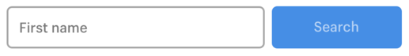
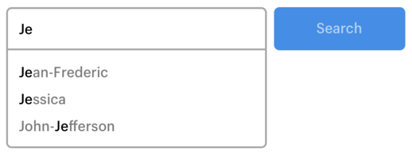

# Typeahead exercise

Create a typeahead search field that provides suggestions based on what the user types. Note that this component would be added to our design system. We’ve included the base design but feel free to add anything that will improve the user experience.

## Mock ups

Initial state

With suggestions

## Design

It's not important to match the exact style of the demo, but here are some properties to help you get started:

<pre>
Input border: #AAAAAA
Button background: #4E8FDF
Button text color: #B7D0F1
</pre>

Data set
Data set to query in the implementation.

<pre>
[
"Jean-Frederic",
"Jonathan",
"Jessica",
"Dominic",
"John-Jefferson",
"Cathryn",
"Kaelig",
"Monica",
"Cynthia",
"Peter",
"Justin"
]
</pre>

## Logic and State

Time permitting, once you are happy with the UX of the typeahead, on a selection of a suggestion show a list/table of how many times a suggestion has been selected.

How would you adapt to not only track how many times suggestions are selected but also searches for strings outside of the dataset?

## Development environment

You are welcome to use the third-party view framework of your choice, or no framework at all. Examples of view frameworks: Vue.js, React, Angular.

However, you cannot use third-party libraries that bring in complete components with full interactions (JS), CSS and markup. Examples: Bootstrap, Material design. Reason: The purpose of the exercise is to see how you would build this component from scratch. We’ll want to have many opportunities to discuss the choices you make relating to mark-up, styling, and interactions.
